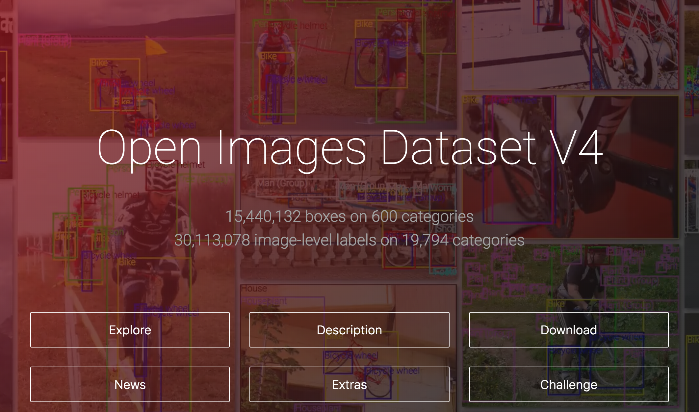

# open images

## About 

This repository is a demonstration data science project and pipeline whose data has been versioned with T4. Here we demonstrate best practices on how to use Quilt to version your data.

### The dataset

The [Open Images Dataset](https://storage.googleapis.com/openimages/web/index.html) is an enormous image dataset intended for use in machine learning projects. A Google project, V1 of this dataset was [initially released](https://ai.googleblog.com/2016/09/introducing-open-images-dataset.html) in late 2016. This repository and project is based on V4 of the data.

The Open Images Dataset is an attractive target for building image recognition algorithms because it is one of the largest, most accurate, and most easily accessible image recognition datasets. For image recognition tasks, Open Images contains 15 million bounding boxes for 600 categories of objects on 1.75 million images. Image labeling tasks meanwhile enjoy 30 million labels across almost 20,000 categories.

To learn more about the Open Images Dataset check out their [homepage](https://storage.googleapis.com/openimages/web/index.html).

### The project

In this project we're going to do something.

### Following along

To follow along, do something.